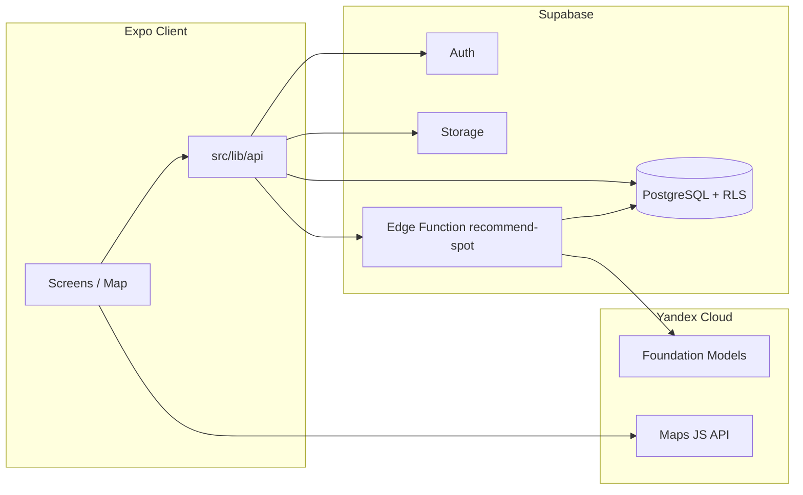

<div align="center">

# Rybalka

**A mobile + web app for anglers:** interactive map, catch log with photos, public/private spot sharing, and an **AI hint** for where to go next.


</div>

---

## About

**Rybalka** is built with **Expo (React Native)** and shares code across **iOS, Android, and Web**.  
Backend uses **Supabase** (PostgreSQL, Auth, RLS, Storage).  
Maps are powered by **Yandex Maps JS API 3.0** (WebView on native, iframe/`srcDoc` on web).

Fishing spot recommendations are generated server-side by the **Supabase Edge Function** `recommend-spot`, which queries **Yandex Cloud Foundation Models**. It combines your current area with nearby catches (public + your private data) and returns:

- target coordinates
- explanation text (`reason`)
- optional bait/species suggestions

---

## Features

### Map and Spots

- Interactive Yandex map with markers, zoom, and coordinate picking mode.
- Two visibility levels for catches: **public** and **private** (enforced with Supabase RLS).
- Marker styling that distinguishes your catches from others plus a dedicated AI marker.

### Catch Journal

- Create catches with species, weight, bait, gear, notes, and visibility.
- Upload multiple photos to **Supabase Storage** (`catch-photos`).
- View, edit, and delete your own catches.
- Show author names on catch cards.

### AI Recommendation

- Big red map button triggers geolocation and calls `recommend-spot` with JWT auth.
- Model context includes map center/radius and nearby catches.
- Response is shown as marker + modal with reason and optional bait/species.

### Authentication

- Email/password sign-up and sign-in via Supabase Auth.
- Route protection: unauthenticated users are redirected to auth screens.
- Email confirmation flow is supported when enabled in Supabase.

---

## Architecture (Brief)



- Client contains only public keys (`EXPO_PUBLIC_*`).
- LLM secrets must be stored via `supabase secrets`, not in client `.env`.
- RLS policies for `catches`, `catch_photos`, `profiles`, and storage objects live in `supabase/migrations/0001_init.sql`.

---

## Tech Stack

- UI: Expo Router, React Native, react-hook-form, Zod, TanStack Query
- Map: Yandex Maps JS API v3, WebView / iframe bridge
- Backend: Supabase (Postgres, Auth, Storage, Edge Functions on Deno)
- AI: Yandex Cloud Foundation Models
- Quality: TypeScript, Jest

---

## Requirements

- Node.js 18+
- Supabase account
- Yandex Maps JavaScript API key
- For AI: Yandex Cloud API key + folder ID

---

## Quick Start

```bash
git clone <repo-url>
cd llm_hft_ryibalka
npm install
cp .env.example .env
```

Fill in `.env` (see Environment Variables), then:

```bash
npx expo start
```

Open the app in simulator/device (Expo Go or dev build), or press `w` for web.

---

## Supabase Setup

1. Create a project in [Supabase](https://supabase.com/).
2. Apply SQL from `supabase/migrations/0001_init.sql` (SQL Editor or `supabase db push`).
3. Enable Email/Password auth provider.

### LLM + `recommend-spot` Edge Function

Install [Supabase CLI](https://supabase.com/docs/guides/cli).  
Do **not** put LLM secrets in client `.env`.

```bash
supabase login
supabase link --project-ref <your-project-ref>
```

Set secrets (supports both `YANDEX_*` and `YANDEX_CLOUD_*` aliases):

```bash
export SUPABASE_ACCESS_TOKEN='sbp_...'
export YANDEX_GPT_API_KEY='AQVN...'
export YANDEX_FOLDER_ID='b1g...'
# optional model override:
export YANDEX_CLOUD_MODEL='yandexgpt-5.1/latest'
npm run llm:secrets
```

Deploy function:

```bash
npm run llm:deploy
```

Equivalent scripts:

- `npm run deploy:function`
- `./scripts/deploy-recommend-function.sh`

`supabase/config.toml` sets `verify_jwt = true` for `recommend-spot`.

---

## Environment Variables

Use `.env` (from `.env.example`) with public client values only:

- `EXPO_PUBLIC_SUPABASE_URL`
- `EXPO_PUBLIC_SUPABASE_ANON_KEY`
- `EXPO_PUBLIC_YANDEX_MAPS_JS_API_KEY`

Restart Metro after `.env` updates.

---

## NPM Scripts

- `npm start` - Expo dev server
- `npm run android` / `npm run ios` / `npm run web`
- `npm run typecheck`
- `npm test`
- `npm run llm:secrets`
- `npm run llm:deploy`
- `npm run build:web`
- `npm run eas:init:project`
- `npm run eas:login` / `npm run eas:whoami`

---

## CI/CD (GitHub Actions)

Workflows:

- `.github/workflows/ci.yml` - install, typecheck, tests, lint
- `.github/workflows/release.yml` - quality checks, web artifact/release, optional Android APK and iOS EAS build
- `.github/workflows/deploy-recommend-spot.yml` - manual deploy of `recommend-spot`

Important secrets:

- `EXPO_PUBLIC_SUPABASE_URL`
- `EXPO_PUBLIC_SUPABASE_ANON_KEY`
- `EXPO_PUBLIC_YANDEX_MAPS_JS_API_KEY`
- `EXPO_TOKEN` (for EAS builds)
- `SUPABASE_ACCESS_TOKEN` (for deploy workflow)

Optional Object Storage upload in release workflow:

- `YANDEX_STORAGE_BUCKET`
- `YANDEX_STORAGE_ACCESS_KEY_ID`
- `YANDEX_STORAGE_SECRET_ACCESS_KEY`

---

## Testing

```bash
npm test
npm run test:coverage
```

Jest uses the React Native preset (`jest.config.js`) and covers auth, API, map HTML bridge, and UI components.

---

## Repository Structure

- `app/` - Expo Router routes (auth, tabs, catch screens)
- `src/components/` - map components, recommendation button, shared UI
- `src/lib/api/` - Supabase data layer
- `src/map/yandexMapHtml.ts` - WebView map bootstrap HTML/JS
- `supabase/migrations/` - DB schema + RLS + storage policies
- `supabase/functions/recommend-spot/` - edge function and AI integration

---

## Yandex Key Notes

- The map key is bundled into the client. Configure strict restrictions in Yandex console (referer/bundle/package).
- If map script returns 403, inspect requests to `api-maps.yandex.ru` in browser DevTools.
- Keep Yandex Cloud AI secrets server-side only (`supabase secrets`).

---

<div align="center">

Built with Expo and Supabase · maps by Yandex · AI hints by Yandex Cloud

</div>
